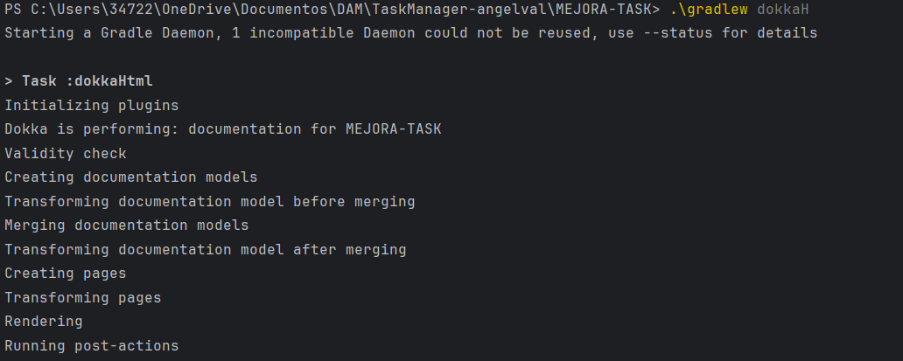
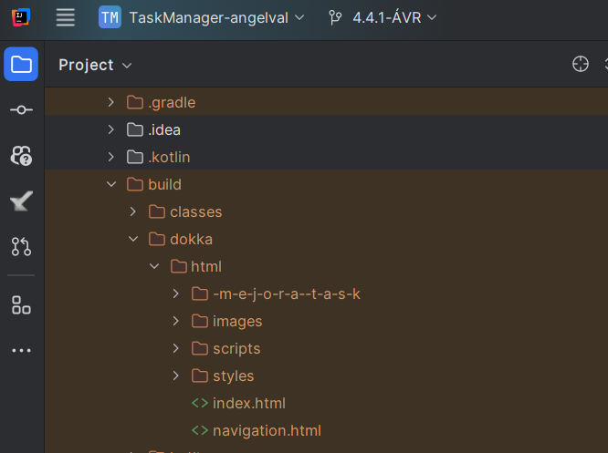
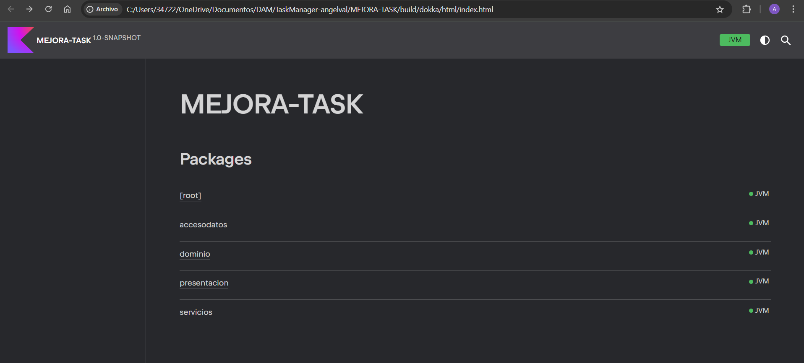

## DOCUMENTACIÓN KDOC EN CÓDIGO
### ActividadService.kt
```kotlin
package servicios


import accesodatos.RepoActividades
import dominio.*
import org.slf4j.LoggerFactory
import presentacion.ConsolaUI

import java.time.DayOfWeek
import java.time.LocalDate
import java.time.format.DateTimeFormatter
import java.time.temporal.WeekFields
import java.util.Locale
/**
 * Servicio principal para la gestión de actividades (tareas y eventos).
 * Proporciona funcionalidades para agregar, listar, filtrar y modificar actividades,
 * así como para gestionar subtareas y generar resúmenes.
 *
 * @property consola Interfaz de usuario para interacción con el usuario
 * @property repo Repositorio de actividades
 * @property servicioUsuario Servicio para gestión de usuarios
 * @property historial Controlador para registro de historial
 * @property logger Logger para registro de eventos
 */
class ActividadService {
    private val consola = ConsolaUI()
    private val repo = RepoActividades()
    private val servicioUsuario = UsuariosService(consola)
    private val historial = ControlDeHistorial()
    private val logger = LoggerFactory.getLogger(ActividadService::class.java)

    /**
     * Gestiona el programa principal mostrando el menú y procesando las opciones seleccionadas.
     * Maneja excepciones globales y registra errores inesperados.
     */
    fun gestionarPrograma() {
        try {
            usuariosConActividades()
            do {
                consola.mostrarMenu()
                val opcion = consola.pedirOpcion("Elige una opción", 0, 6)
                gestionarOpcion(opcion)
            } while (opcion != 0)
        } catch (e: Exception) {
            logger.error("Error inesperado al gestionar el programa: ${e.message}", e)
        }
    }

    /**
     * Agrega una subtarea a una tarea existente.
     *
     * @throws NumberFormatException Si el ID de la tarea madre no es un número válido
     * @throws IllegalStateException Si no se encuentra la tarea madre
     */
    private fun agregarSubtarea() {
        try {
            // Listar las tareas disponibles para elegir la tarea madre
            consola.listarTareas(repo.tareas)

            // Pedir al usuario que seleccione la tarea madre por ID
            val idTareaMadre = consola.pedirInfo("Introduce el ID de la tarea madre a la que deseas agregar una subtarea:").toIntOrNull()
            val tareaMadre = repo.tareas.find { it.getIdActividad().toInt() == idTareaMadre }

            if (tareaMadre != null) {
                // Crear la subtarea
                val subtarea = Tarea.creaInstancia(
                    consola.pedirInfo("Descripción de la subtarea:"),
                    consola.pedirInfo("Usuario asignado:"),
                    consola.pedirEtiqueta()
                )

                // Asignar la subtarea a la tarea madre
                tareaMadre.agregarSubTarea(subtarea)

                // Actualizar el fichero para incluir la tarea madre con sus subtareas
                Utils.actualizarTareaEnFichero(tareaMadre)

                println("¡Subtarea añadida con éxito!")
                historial.agregarHistorial("Subtarea agregada a la tarea ${tareaMadre.getIdActividad()}")
            } else {
                println("Error: No se encontró la tarea madre con el ID proporcionado.")
            }
        } catch (e: Exception) {
            println("¡Error! Detalle: ${e.message}")
        }
    }


    private fun usuariosConActividades() {
        try {
            for (usuario in servicioUsuario.usuariosRepo.usuarios) {
                for (actividad in repo.actividades) {
                    if (actividad.obtenerUsuario() == usuario.nombre && !usuario.repoActividades.actividades.contains(actividad)) {
                        usuario.repoActividades.actividades.add(actividad)
                        when (actividad) {
                            is Tarea -> usuario.repoActividades.tareas.add(actividad)
                            is Evento -> usuario.repoActividades.eventos.add(actividad)
                        }
                    }
                }
            }
            logger.trace("Usuarios asociados con actividades correctamente.")
        } catch (e: Exception) {
            logger.error("Error al asociar usuarios con actividades: ${e.message}", e)
        }
    }

    private fun cambiarEstado(tarea: Tarea) {
        val estadoNuevo = consola.pedirInfo("CAMBIE EL ESTADO DE LA TAREA: ABIERTA, EN_PROGRESO, FINALIZADA")
        val estado = EstadoTarea.getEstado(estadoNuevo)
        if (estado != null) {
            tarea.actualizarEstado(estado)
            repo.cambiarEstado(tarea, historial, estado)
            println("¡Estado de la tarea y su subtarea actualizado con éxito!")
        } else {
            println("¡Error! Estado no válido.")
        }
    }

    private fun filtradoPorTipo(){
        var opcion = -1

        do{
            try{
                println("1) Mostrar tareas")
                println("2) Mostrar eventos")
                println("0) SALIR")
                opcion = consola.pedirOpcion("Introduce opción",0,2)
                when(opcion){
                    1-> consola.listarTareas(repo.tareas)
                    2-> consola.listarEventos(repo.eventos)
                    else-> Exception("El valor introducido se sale del rango")
                }
            }catch(e: Exception){
                println("¡Error! Detalle: $e")
            }
        }while(opcion != 0)
    }

    private fun filtrarPorEstado(){
        var opcion = -1

        do{
            try{
                println("1) MOSTRAR ABIERTAS")
                println("2) MOSTRAR EN PROGRESO")
                println("3) MOSTRAR FINALIZADAS")
                println("0) SALIR")
                opcion = consola.pedirOpcion("Introduce opción",0,3)

                var filtrado: EstadoTarea? = null

                when(opcion){
                    1-> filtrado = EstadoTarea.ABIERTA
                    2-> filtrado = EstadoTarea.EN_PROGRESO
                    3-> filtrado = EstadoTarea.FINALIZADA
                    else-> Exception("El valor introducido se sale del rango")
                }

                for(tarea in repo.tareas){
                    if(tarea.estado == filtrado){
                        println(tarea.obtenerDetalle())
                    }
                }

            }catch(e: Exception){
                println("¡Error! Detalle: $e")
            }
        }while(opcion != 0)
    }

    private fun filtradoPorUsuarios(){
        var seguir = true
        do{
            var encontrado = false
            try{
                println("Introduzca el nombre del usuario")
                val nombre = readln().trim()

                for(usuario in servicioUsuario.usuariosRepo.usuarios){
                    if(usuario.nombre == nombre){
                        encontrado = true
                        for(actividad in usuario.repoActividades.actividades){
                            println(actividad.obtenerDetalle())
                        }
                    }
                }

                if(!encontrado){
                    println("El usuario introducido no ha sido encontrado")
                    seguir = consola.preguntarSeguir()
                }

                else{
                    seguir = consola.preguntarSeguir()
                }
            }catch(e: Exception){
                println("¡Error! Detalle: $e")
            }
        }while(seguir)
    }
    private fun filtradoPorEtiquetas(){
        var opcion = -1

        do{
            try{
                println("1) Mostrar tareas URGENTES")
                println("2) Mostrar tareas SENCILLAS")
                println("3) Mostrar tareas de DOCUMENTACIÓN")
                println("4) Mostrar tareas de REVISIÓN")
                println("0) SALIR")
                opcion = consola.pedirOpcion("Introduce opción",0,4)

                var filtrado: EtiquetasTareas? = null
                when(opcion){
                    1-> filtrado = EtiquetasTareas.URGENTE
                    2-> filtrado = EtiquetasTareas.SENCILLA
                    3-> filtrado = EtiquetasTareas.DOCUMENTACION
                    4-> filtrado = EtiquetasTareas.REVISION
                    else-> Exception("El valor introducido se sale del rango")
                }
                for(tarea in repo.tareas){
                    if(tarea.etiqueta == filtrado){
                        println(tarea.obtenerDetalle())
                    }
                }
            }catch(e: Exception){
                println("¡Error! Detalle: $e")
            }
        }while(opcion != 0)
    }

    private fun filtradoPorFechas() {
        var opcion: Int
        do {
            println("Selecciona una opción para filtrar actividades:")
            println("1) Enseñar actividades para hoy")
            println("2) Enseñar actividades para mañana")
            println("3) Enseñar actividades de esta semana")
            println("4) Enseñar actividades de este mes")
            println("0) SALIR")

            opcion = consola.pedirOpcion("Elige una opción", 0, 4)

            when (opcion) {
                1 -> filtrarActividades { it.fecha== Utils.obtenerFechaActual() }
                2 -> filtrarActividades { it.fecha == LocalDate.now().plusDays(1).format(DateTimeFormatter.ofPattern("dd-MM-yyyy")) }
                3 -> filtrarActividades { fechaDentroDeSemana(it.fecha) }
                4 -> filtrarActividades { fechaDentroDeMes(it.fecha) }
                0 -> println("Saliendo del filtrado por fechas...")
                else -> println("Opción no válida, intenta de nuevo.")
            }
        } while (opcion != 0)
    }

    /**
     * Filtra actividades según un criterio especificado.
     *
     * @param condicion Función lambda que define el criterio de filtrado
     */
    private fun filtrarActividades(condicion: (Actividad) -> Boolean) {
        val actividadesFiltradas = repo.actividades.filter(condicion)
        if (actividadesFiltradas.isEmpty()) {
            println("No hay actividades que coincidan con el filtro.")
        } else {
            println("Actividades encontradas:")
            actividadesFiltradas.forEach { println(it.obtenerDetalle()) }
        }
    }

    private fun fechaDentroDeSemana(fecha: String): Boolean {
        val hoy = LocalDate.now()
        val inicioSemana = hoy.with(DayOfWeek.MONDAY)
        val finSemana = hoy.with(DayOfWeek.SUNDAY)
        val fechaActividad = LocalDate.parse(fecha, DateTimeFormatter.ofPattern("dd-MM-yyyy"))
        return !fechaActividad.isBefore(inicioSemana) && !fechaActividad.isAfter(finSemana)
    }

    private fun fechaDentroDeMes(fecha: String): Boolean {
        val hoy = LocalDate.now()
        val fechaActividad = LocalDate.parse(fecha, DateTimeFormatter.ofPattern("dd-MM-yyyy"))
        return fechaActividad.month == hoy.month && fechaActividad.year == hoy.year
    }
    private fun filtrar(){
        var opcion = -1
        do {
            try {
                println("SELECCIONE UN MODO DE FILTRADO")
                println("1.- Por tipo (Tarea/Evento)")
                println("2.- Por estado")
                println("3.- Por etiquetas")
                println("4.- Por usuarios")
                println("5.- Por fechas")
                println("0) SALIR")
                opcion = consola.pedirOpcion(">> ",0,5)

                when(opcion){
                    1-> filtradoPorTipo()
                    2-> filtrarPorEstado()
                    3-> filtradoPorEtiquetas()
                    4-> filtradoPorUsuarios()
                    5-> filtradoPorFechas()
                }
            }catch(e: Exception){
                println("¡Error! Vuelve a introducir Detalle: $e")
            }
        }while(opcion != 0)
    }

    /**
     * Muestra un resumen estadístico de las actividades:
     * - Total de tareas y eventos
     * - Actividades para hoy, mañana, esta semana y este mes
     */
    private fun resumen() {
        val formatter = DateTimeFormatter.ofPattern("dd-MM-yyyy")
        val hoy = LocalDate.now()
        val manana = hoy.plusDays(1)
        val semana = hoy.get(WeekFields.of(Locale.getDefault()).weekOfYear())
        val mes = hoy.monthValue

        // Filtrar actividades por fecha
        val actividadesHoy = repo.actividades.filter {
            LocalDate.parse(it.fecha, formatter) == hoy
        }
        val actividadesManana = repo.actividades.filter {
            LocalDate.parse(it.fecha, formatter) == manana
        }
        val actividadesSemana = repo.actividades.filter {
            val fechaActividad = LocalDate.parse(it.fecha, formatter)
            fechaActividad.get(WeekFields.of(Locale.getDefault()).weekOfYear()) == semana
        }
        val actividadesMes = repo.actividades.filter {
            val fechaActividad = LocalDate.parse(it.fecha, formatter)
            fechaActividad.monthValue == mes
        }

        // Imprimir resumen
        println("--------------------------------------------------")
        println("TOTAL DE TAREAS MADRES: ${repo.actividades.size}")
        println("TOTAL DE EVENTOS: ${repo.eventos.size}")
        println("EN TOTAL ${repo.actividades.size} ACTIVIDADES REALIZADAS")
        println("--------------------------------------------------")
        println("ACTIVIDADES PARA HOY: ${actividadesHoy.size}")
        println("ACTIVIDADES PARA MAÑANA: ${actividadesManana.size}")
        println("ACTIVIDADES PARA ESTA SEMANA: ${actividadesSemana.size}")
        println("ACTIVIDADES PARA ESTE MES: ${actividadesMes.size}")
        println("--------------------------------------------------")
        historial.agregarHistorial("Se ha mirado el resumen del programa")
    }

    private fun gestionarOpcion(opcion: Int) {
        when (opcion) {
            1 -> anadirActividad()
            2 -> listarActividades()
            3 -> cambiarEstado(pedirIdTarea())
            4 -> filtrar()
            5-> agregarSubtarea()
            6-> resumen()
        }
    }

    private fun anadirActividad() {
        val opcion = consola.pedirOpcion("¿Qué quieres crear?\n1) Tarea\n2) Evento\n0) Cancelar", 0, 2)
        if (opcion == 0) return

        val actividad = consola.crearActividad(opcion, repo, servicioUsuario.usuariosRepo)
        if (actividad != null) {
            repo.aniadirActividad(actividad)
            println("¡Actividad añadida con éxito!")
            historial.agregarHistorial("Actividad agregada con éxito")
        } else {
            println("¡Error al crear la actividad!")
            historial.agregarHistorial("Error al crear actividad")
        }
    }

    private fun listarActividades() {
        val actividadesUnicas = repo.actividades.distinct() // Eliminar duplicados
        consola.listarActividades(actividadesUnicas.toMutableList())
        historial.agregarHistorial("Se listan todas las actividades")
    }

    private fun pedirIdTarea(): Tarea {
        var tareaEncontrada: Tarea? = null
        var tareaValida = false
        do {
            try {
                println("Introduzca el ID de la tarea:")
                val id = readln().toInt()
                tareaEncontrada = repo.tareas.first { it.getIdActividad().toInt() == id }
                tareaValida = true
            } catch (e: NoSuchElementException) {
                println("¡Error! ID no encontrado, inténtelo de nuevo.")
                historial.agregarHistorial("ID de la actividad no encontrado, se intenta de nuevo")
            }
        } while (!tareaValida)
        return tareaEncontrada!!
    }

    companion object {
        fun iniciarPrograma() {
            ActividadService().gestionarPrograma()
        }
    }
}
```

### Tarea.kt
```kotlin
package dominio
/**
 * Clase que representa una tarea en el sistema, heredando de Actividad.
 * Permite gestionar subtareas y estados de la tarea.
 *
 * @property etiqueta Clasificación de la tarea (URGENTE, SENCILLA, etc.)
 * @property estado Estado actual de la tarea (ABIERTA, EN_PROGRESO, FINALIZADA)
 * @property subTareas Lista de subtareas asociadas a esta tarea
 */
class Tarea private constructor(
    descripcion: String,
    usuario: String,
    val etiqueta: EtiquetasTareas
) : Actividad(descripcion, usuario) {

    init{
        contador += 1
    }
    var estado = EstadoTarea.ABIERTA

    // Lista de subtareas asociadas
    val subTareas: MutableList<Tarea> = mutableListOf()

    private constructor(
        usuario: String,
        id: String,
        etiqueta: EtiquetasTareas,
        fechaCreacion: String,
        descripcion: String,
        estado: String
    ) : this(usuario, descripcion, etiqueta) {
        this.id = id + contador
        this.fechaCreacion = fechaCreacion
        this.estado = EstadoTarea.getEstado(estado)!!
    }

    override fun obtenerDetalle(): String {
        val subTareasDetalle = if (subTareas.isEmpty()) {
            "Sin subtareas"
        } else {
            subTareas.joinToString(separator = "\n") { "    - ${it.obtenerDetalle()}" }
        }
        return super.obtenerDetalle() + ";$estado;$etiqueta;\nSubtareas:\n$subTareasDetalle"
    }

    /**
     * Actualiza el estado de la tarea y todas sus subtareas.
     *
     * @param estado Nuevo estado a asignar
     */
    fun actualizarEstado(estado: EstadoTarea) {
        this.estado = estado
        for(tarea in subTareas) {
            tarea.estado = estado
        }
    }

    /**
     * Agrega una subtarea a esta tarea.
     *
     * @param subTarea Subtarea a agregar
     * @throws IllegalArgumentException Si la subtarea ya tiene subtareas propias
     */
    fun agregarSubTarea(subTarea: Tarea) {
        if (!subTareas.contains(subTarea)) { // Evitar duplicados en la lista de subtareas
            // Validar que las subtareas no puedan tener más subtareas
            if (subTarea.subTareas.isNotEmpty()) {
                throw IllegalArgumentException("Una subtarea no puede tener más subtareas.")
            }
            subTareas.add(subTarea)
        } else {
            println("La subtarea ya existe, no se añadirá de nuevo.")
        }
    }

    companion object {
        /**
         * Contador estático para generación de IDs únicos.
         */
        var contador = 0

        /**
         * Crea una nueva instancia de Tarea con los parámetros básicos.
         *
         * @param descripcion Descripción de la tarea
         * @param usuario Usuario asignado a la tarea
         * @param etiqueta Clasificación de la tarea
         * @return Nueva instancia de Tarea
         */
        fun creaInstancia(descripcion: String, usuario: String, etiqueta: EtiquetasTareas): Tarea {
            return Tarea(descripcion, usuario, etiqueta)
        }

        fun creaInstancia(
            usuario: String,
            id: String,
            etiqueta: EtiquetasTareas,
            fechaCreacion: String,
            descripcion: String,
            estado: String
        ): Tarea {
            return Tarea(usuario, id, etiqueta, fechaCreacion, descripcion, estado)
        }
    }
}
```

### ControlDeHistorial.kt
```kotlin
package servicios

import org.slf4j.Logger
import org.slf4j.LoggerFactory
import java.io.File
import java.time.LocalDateTime
/**
 * Clase para el control y registro del historial de operaciones del sistema.
 * Permite registrar mensajes tanto en un archivo como mediante un logger.
 *
 * @property logger Logger SLF4J para registro de eventos
 */
open class ControlDeHistorial {

    private val logger: Logger = LoggerFactory.getLogger(ControlDeHistorial::class.java)

    /**
     * Agrega una entrada al historial del sistema.
     * Registra el mensaje tanto en el logger como en el archivo de historial.
     *
     * @param msj Mensaje a registrar en el historial
     * @throws IOException Si ocurre un error al escribir en el archivo
     */
    fun agregarHistorial(msj: String) {
        val log = "${LocalDateTime.now()} -> $msj"
        logger.info(log) // Registrar en el logger
        try {
            File(RUTA_HISTORIAL).appendText("$log\n")
        } catch (e: Exception) {
            logger.error("Error al escribir en el historial: ${e.message}", e)
        }
    }

    companion object {
        /**
         * Ruta del archivo donde se almacena el historial de operaciones.
         */
        const val RUTA_HISTORIAL = "MEJORA-TASK/src/main/kotlin/Datos/Historial.txt"
    }
}
```


## GENERACIÓN CON DOKKA
En la terminal ponemos el siguiente comando para generar la documentación en html con dokka:



Aquí vemos las carpetas y archivos generadas por el dokka. Si le damos a la carpeta "index.html" nos abrirá la documentación generada por el dokka. Si le damos a la carpeta "index.html" nos abrirá la documentación generada por el dokka.



Y esta es el resultado de la documentación generada por el dokka. La cual podemos ver en el navegador.




