## INTALACIÓN Y COMANDO
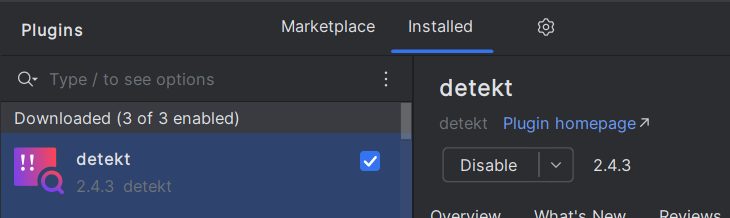
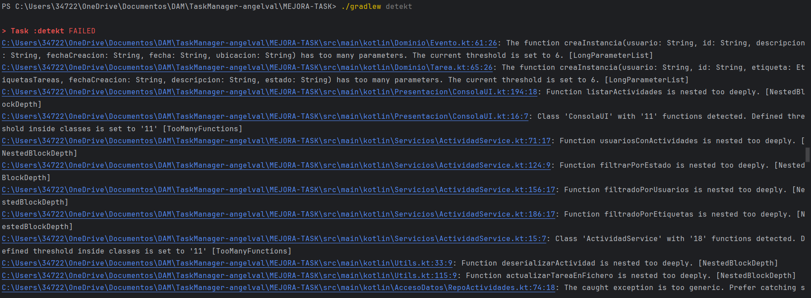

## ERROR 1 

El error ocurre porque hay demasiados niveles de código dentro de la función cargarActividades. Para arreglarlo, se puede sacar parte del código y ponerlo en otra función aparte. Así, el código principal queda más simple y fácil de manejar.

## ERROR 2

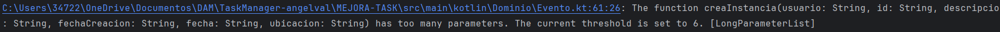

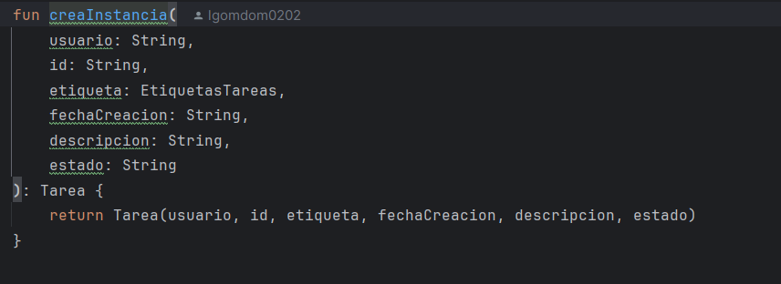

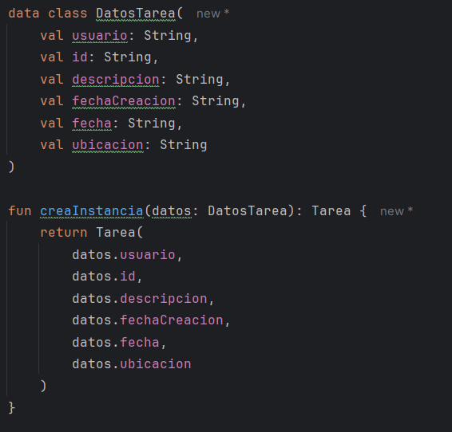

El error indica que la función tiene demasiados parámetros. Para solucionarlo, agrupa los parámetros relacionados en una data class y pásala como argumento.

## ERROR 3

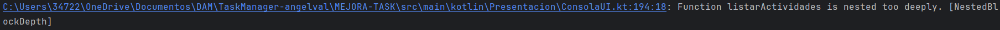

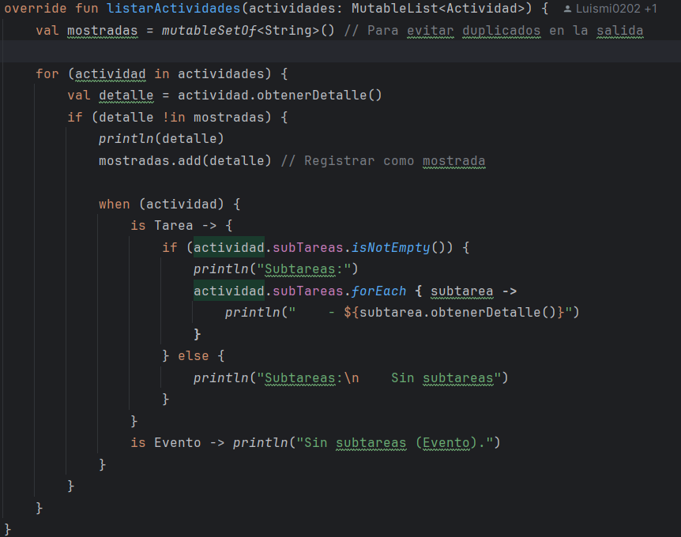

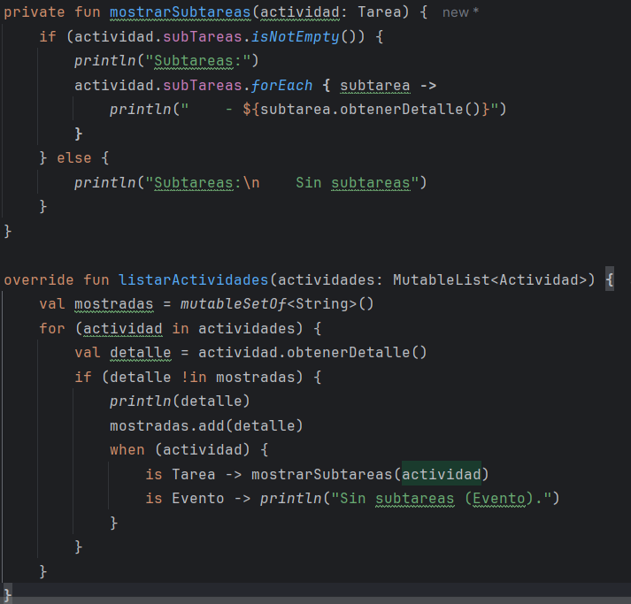

El problema se debe a la anidación de bloques dentro de listarActividades. Para solucionarlo, extrae la lógica de impresión de subtareas a una función auxiliar. Así reduces la profundidad y mejoras la legibilidad.

## ERROR 4

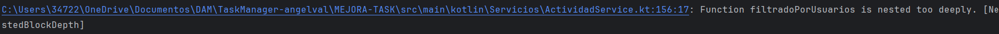

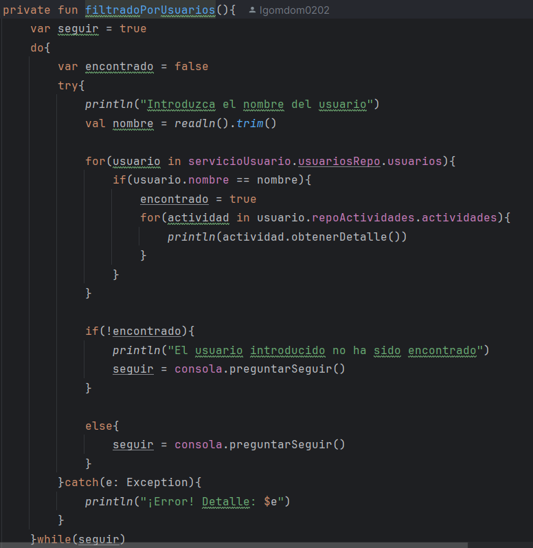

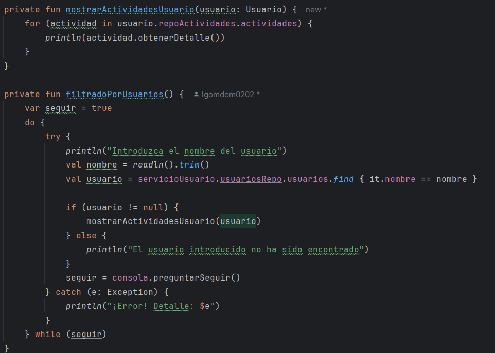

El problema de anidamiento se soluciona extrayendo la lógica de impresión de actividades del usuario a una función auxiliar. Así se reduce la profundidad de la función principal.

## ERROR 5

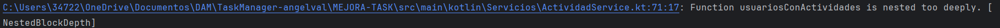

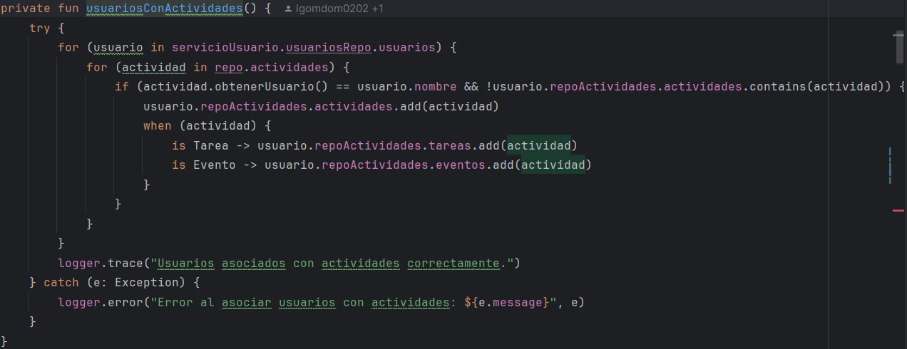

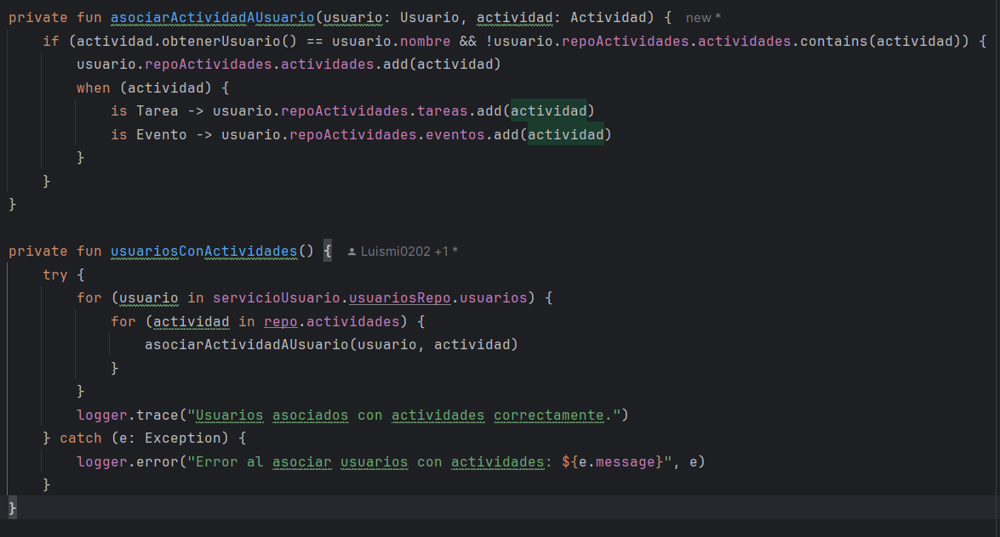

El problema de anidamiento en usuariosConActividades se soluciona extrayendo la lógica de asociación de actividades a una función auxiliar. Así se reduce la profundidad y mejora la legibilidad.

Responde a las preguntas:

[1]
1.a ¿Que herramienta has usado, y para que sirve?
1.b ¿Cuales son sus características principales?
1.c ¿Qué beneficios obtengo al utilizar dicha herramienta?
[2]
2.a De los errores/problemas que la herramienta ha detectado y te ha ayudado a solucionar, ¿cual es el que te ha parecido que ha mejorado más tu código?
2.b ¿La solución que se le ha dado al error/problema la has entendido y te ha parecido correcta?
2.c ¿Por qué se ha producido ese error/problema?
[3]
3.a ¿Que posibilidades de configuración tiene la herramienta?
3.b De esas posibilidades de configuración, ¿cuál has configurado para que sea distinta a la que viene por defecto?
3.c Pon un ejemplo de como ha impactado en tu código, enlazando al código anterior al cambio, y al posterior al cambio,
[4]
4 ¿Qué conclusiones sacas después del uso de estas herramientas?