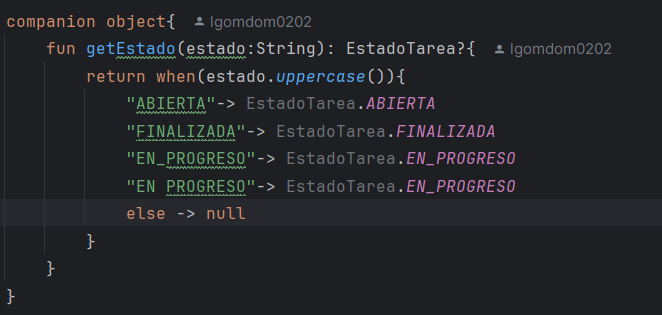
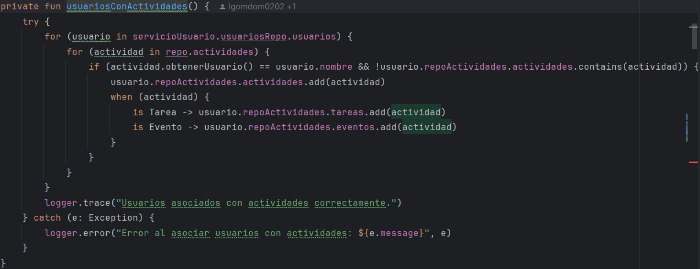
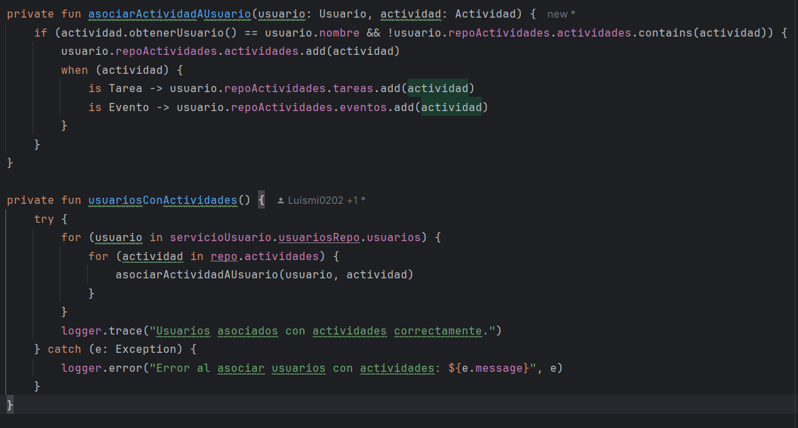
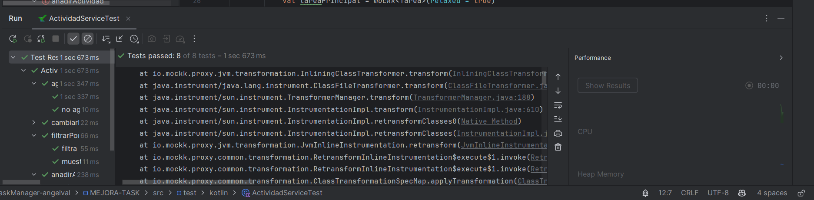

## INTALACIÓN Y COMANDO

## ERROR 1 

El error ocurre porque hay demasiados niveles de código dentro de la función cargarActividades. Para arreglarlo, se puede sacar parte del código y ponerlo en otra función aparte. Así, el código principal queda más simple y fácil de manejar.

## ERROR 2

El error indica que la función tiene demasiados parámetros. Para solucionarlo, agrupa los parámetros relacionados en una data class y pásala como argumento.

## ERROR 3

El problema se debe a la anidación de bloques dentro de listarActividades. Para solucionarlo, extrae la lógica de impresión de subtareas a una función auxiliar. Así reduces la profundidad y mejoras la legibilidad.

## ERROR 4

El problema de anidamiento se soluciona extrayendo la lógica de impresión de actividades del usuario a una función auxiliar. Así se reduce la profundidad de la función principal.

## ERROR 5

El problema de anidamiento en usuariosConActividades se soluciona extrayendo la lógica de asociación de actividades a una función auxiliar. Así se reduce la profundidad y mejora la legibilidad.

En esta línea de código "baseline = file("config/detekt/detekt.xml")" se establece la ruta del archivo de configuración de Detekt. Este archivo contiene las reglas y configuraciones personalizadas que se aplicarán durante el análisis del código. Al especificar esta ruta, se asegura que Detekt guarde un registro de los problemas detectados y pueda comparar el código actual con el estado anterior, facilitando la identificación de nuevos problemas y la mejora continua del código.