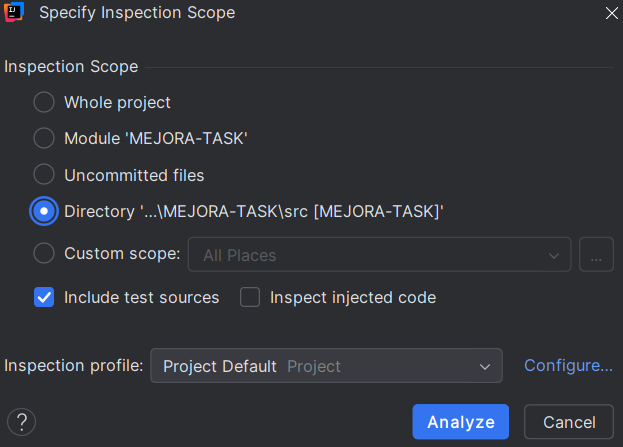
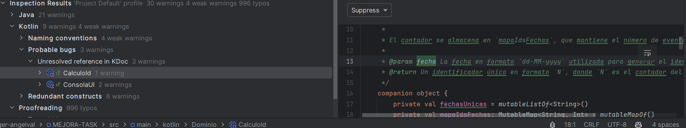
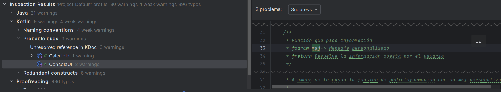
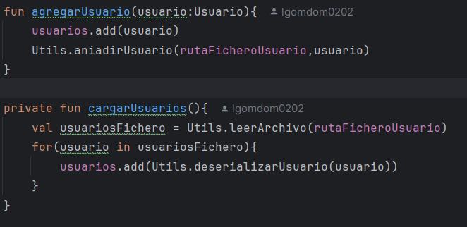
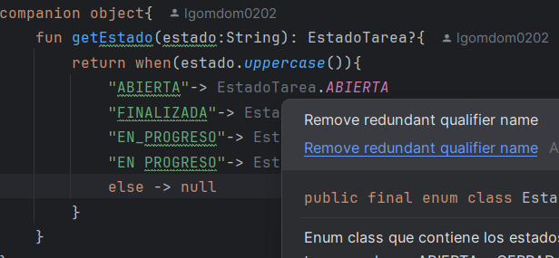

Para analizar el código debes darle click derecho en la carpeta que quieras analizar y darle a "Analyce" y luego a inspect code.

Luego te saldrá una ventana donde puedes elegir el tipo de análisis que quieres hacer, yo he elegido el del directorio.

Te tendrá que salir un informe como este:

Aquí vemos solo 4 tipos de errores que son todos los que me salen a mí.

- 1 error (Probable bugs):

- 2 error (Probable bugs):

- 3 error (Redundant constructs):

- 4 error (Typo):

- 5 error (Typo):

### Proceso para hacer el refact

### Antes de hacer el refact

### Despues de hacer el refact

### 2 Introducir parmátro objeto
### Antes del Refact

### Despues del Refact

### 3 Quitar código redundante
### Antes del Refact

### Despues del Refact

